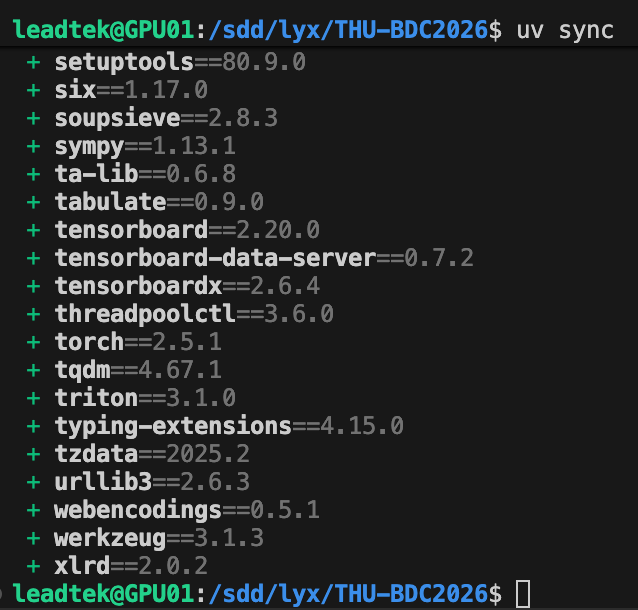
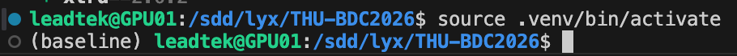
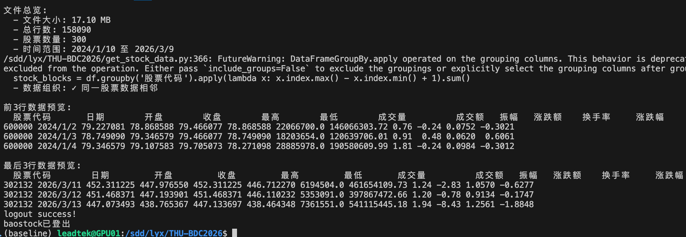
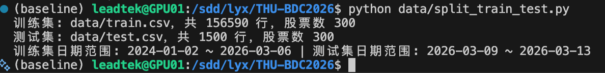
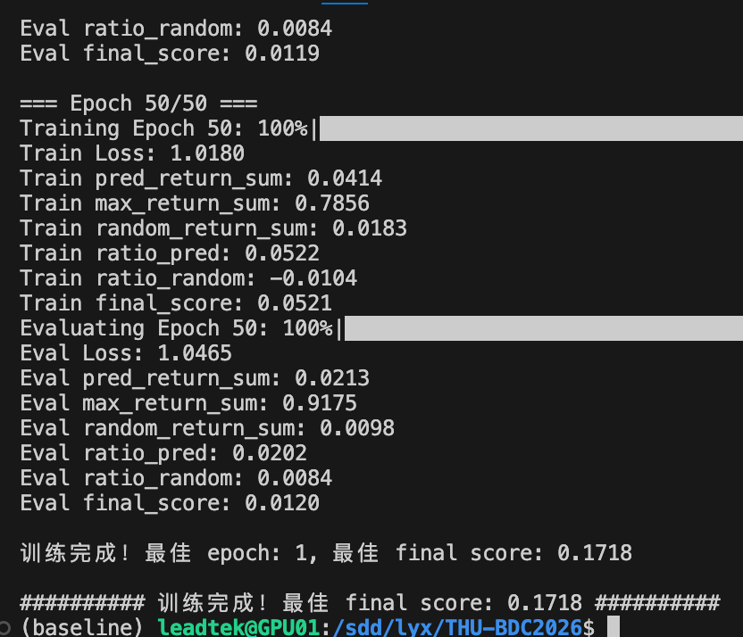
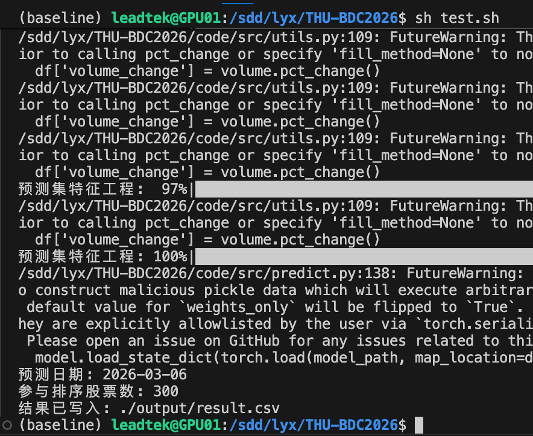
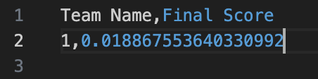
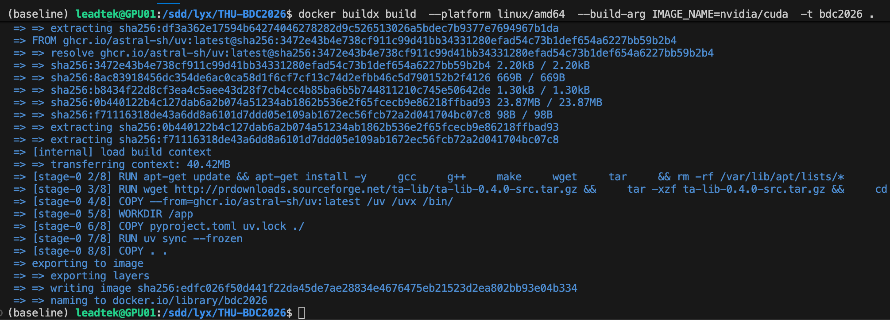
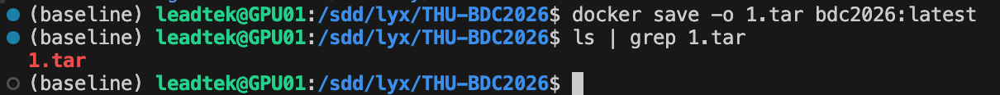

# 配置环境
提前安装uv
可以在有conda的情况下直接pip install uv或者参考互联网上uv的安装教程
1) 使用 `uv` 安装依赖
`uv sync`

成功安装



2) 激活虚拟环境

linux

`source .venv/bin/activate`

windows

`.\.venv\Scripts\activate`

成功激活



# 准备数据
## 下载所有数据
在get_stock_data.py中223,224行修改：
```
start_date = "***"
end_date = "***"
```
建议先将现有数据删除后，再运行`python get_stock_data.py`，即可下载所需时间段的数据，默认保存为data/stock_data.csv

（如果出现网络问题，请关闭代理重试，多尝试几次）

成功下载数据



## 划分训练，测试集
在测试最终的得分时，需要先将数据划分为训练数据和测试数据，一般将数据的最后5个交易日设置为test数据，之前的数据为训练数据

修改data/split_train_test.py中23-46行代码中设置训练集开始，结束时间，测试集的开始，结束时间。

运行`python data/split_train_test.py`，即可在data目录下生成train.csv与test.csv

成功划分数据集


# 训练与预测

当前 v1.19 训练独立的 205维 `158+39_reduced25_relmarket12_risk15_indresid12` RankGLU
Transformer 和 `rank_xendcg` LightGBM，不复用或覆盖 v1.17/v1.18 工件。除五年行情外，需准备
`data_5y/stock_industry_history.csv`，其中必须包含 `effective_date,stock_id,industry`；特征只使用
预测日期当日或之前的行业快照。运行 `./train.sh` 后，模型工件根目录必须同时保留 `config.json`、
`scaler.pkl`、`stockid2idx.json`、checkpoint、LightGBM 模型和 `artifact_manifest.json`。

`artifact_manifest.json` 的 `feature_count` 必须为205，且记录 `feature_num`、
`sequence_length`、`stock_mapping_size`、`score_head_variant=rankglu_v1`、bottleneck 与 gamma 上界。
`./test.sh` 会在特征工程前检查 manifest、Scaler、checkpoint 输入宽度、RankGLU 头和股票 embedding；
不得把 v1.16 的193维或旧 MLP score-head 工件接入 v1.19。
旧 v1.16 工件仅在切回其193维配置与策略目录后兼容运行。

在 `code/` 目录执行 `./train.sh` 开始 v1.19 单种子三折训练和全开发期重训。它会完整评估两条
预注册候选：`rankglu_transformer_only` 与 `rankxendcg_lgbm_only`，不搜索中间融合权重。风险惩罚、
反转、相关性策略和相关簇替换固定关闭；Allocation 保留 Head 25%，Exposure 保留 Head 25%，其余
Exposure 使用近满仓 fallback。训练完成后先查看 `cross_validation_summary.json` 的
`pre_registered_candidates` 和 `selected_candidate`：只有被选候选的 `promotion_criteria.passed=true`
才可进行锁箱评估。

锁箱仅可运行一次，且不会训练模型：

```bash
LOCKBOX_EVAL=1 ./train.sh
```

它使用冻结的末两个月数据，以 `t+1` 开盘入场、`t+5` 收盘退出，并每5个交易日取一个非重叠锚点，
对比 v1.17 baseline 与已晋级 v1.19 候选；结果原子写入 v1.19 目录的 `lockbox_report.json`，存在时
拒绝覆盖。只有该报告的 `accepted_for_final_deployment=true` 后，才可以运行：

```bash
V17_INCLUDE_LOCKBOX=1 LOCKBOX_ACCEPTED=1 ./train.sh
```

最终重训写入独立 `v1.19_full5y_deployment` 目录。之后运行 `./test.sh` 做工件、推理、股票唯一性和
资金约束验证；若 `test.csv` 最大日期不晚于预测日，报告会明确拒绝计算本地后验收益。

成功完成训练



预测：运行根目录下的sh test.sh

windows可以直接运行`python code/src/predict.py`

成功完成预测



训练和测试都完成之后，会在output目录下生成 `result.csv` 与
`prediction_diagnostics.json`。后者记录提交日状态、行业集中度、资金约束和风险诊断，供
`report_metrics.py` 展示；它不参与赛事提交。

得到result.csv之后，可以运行`python test/score_self.py`，将选手的预测股票与测试集比较，在计算出最终的加权收益率，作为选手可自行参考的得分，默认保存在/temp/tmp.csv。

得到参考分数



**注意**当前策略从 ranking score 选择最多五只股票，再使用 Allocation/Exposure 头和策略校准
分配权重；权重和不得超过1，现金权重为 `1 - sum(weight)`。

# 打包docker
在训练与测试完成之后，需要首先将项目整体打包成一个docker镜像（打包），再将该镜像导出为一个.tar文件（导出），最终提交该tar文件即可，里面需要包含运行时的所有环境及依赖，具体可以参考或修改Dockerfile

## docker镜像创建

如果出现网络请求错误，请尝试使用代理或关闭代理。或者参考[本文](https://blog.csdn.net/m0_70878103/article/details/144130047)

镜像创建指令：
`docker buildx build  --platform linux/amd64  --build-arg IMAGE_NAME=nvidia/cuda  -t bdc2026 .`

成功创建镜像



## 镜像导出
`docker save -o 队伍名称.tar bdc2026:latest`

成功导出镜像为.tar文件



# 可运行性验证
选手根据需要可以进行三步运行验证，包括：
1. 本机环境直接运行验证

需要选手保证根目录的train.sh, test.sh成功运行，并且在output目录下生成一个result.csv

2. 对打包后的docker进行完整运行验证

在这一步，选手需要按照打包docker的流程先将项目打包为一个镜像（对应上面的docker镜像创建），暂时不用导出为.tar文件

然后在根目录下运行`docker compose up`。这一步会对打包成的docker是否可运行进行验证，如果运行后在test/output中得到result.csv，验证即成功。

3. (可选)模拟赛事方最终以批处理的方式进行打分验证

这一步需要选手将镜像导出为tar文件（最终需要选手提交的文件），然后将tar文件放到test/tars目录下，并将.tar文件名写入test/tar_files_list.txt文件中。（比如tar文件叫1.tar，则在tar_files_list.txt的第一行写入1.tar即可）

然后在根目录下运行
linux
`python test/test.py`
windows
`python test/test_windows.py`

成功运行后，如果在test/result.csv中看到，类似下面的结果，该步验证成功。
```
Team Name,Final Score
1,0.018867553640330992
```
